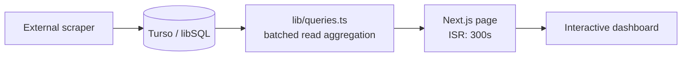

# Marino Stats Web

[](https://nextjs.org)
[](https://react.dev)
[](https://www.typescriptlang.org)
[](https://tailwindcss.com)
[](https://turso.tech)

A Next.js dashboard for Northeastern recreation facility traffic. It turns scraped occupancy counts into a quick answer to a practical question: **should I go to the gym now?**

The app reads historical counts from Turso, renders recent zone charts, highlights traffic patterns by weekday and hour, and compares semester-level usage trends across Marino Recreation Center and related recreation facilities.

[Overview](#overview) • [Features](#features) • [Getting Started](#getting-started) • [Data Model](#data-model) • [Project Structure](#project-structure) • [Troubleshooting](#troubleshooting)

> [!IMPORTANT]
> This repository is the dashboard only. The scraper that reads [Northeastern Recreation Live Facility Counts](https://recreation.northeastern.edu/live-facility-counts/) and writes to Turso runs outside this project.

## Overview

Marino Stats Web is built as a mostly server-rendered analytics surface:

- `app/page.tsx` fetches the dashboard payload and uses ISR with a 5-minute revalidation window.
- `lib/queries.ts` aggregates all required data in one Turso `db.batch(..., "read")` call.
- `components/dashboard.tsx` hydrates a small client layer for date selection, zone selection, chart interactions, pinned zones, and the live Eastern-time clock.

The result is a compact, cache-friendly page that can still support interactive filtering without public API routes.



## Features

- **Traffic heatmap**: weekday-by-hour grid for the selected zone, using one latest completed date per weekday to avoid stale fallback slots.
- **Recent zone charts**: per-zone Recharts area charts over the latest 8 dates with capacity-aware axes.
- **Rest-of-day forecast**: dashed projection for today's charts, based on current-semester day-of-week baselines scaled by today's actual traffic.
- **Semester comparison**: hourly average lines by semester, with new semesters appearing automatically as data accumulates.
- **Pinned zones**: browser-local pins keep frequently visited zones near the top.
- **Closure awareness**: academic calendar and facility-specific closure rules keep holidays, snow days, and SquashBusters weekend closures out of baselines.
- **Dark mode**: neutral UI with Northeastern red accents and chart tokens shared across light and dark themes.
- **Credential-safe builds**: when Turso env vars are absent, the app builds and renders a setup notice instead of failing.

## Tech Stack

| Layer | Technology |
| --- | --- |
| App framework | [Next.js 16](https://nextjs.org) App Router |
| UI runtime | [React 19](https://react.dev), TypeScript |
| Styling | [Tailwind CSS 4](https://tailwindcss.com), shadcn/ui components on Base UI primitives |
| Charts | [Recharts](https://recharts.org) |
| Database | [Turso](https://turso.tech) / libSQL via `@libsql/client` |
| Deployment fit | Vercel or any Node-capable Next.js host |

## Getting Started

### Prerequisites

- Node.js 20+
- npm
- A Turso database populated by a separate scraper

### Installation

```bash
git clone https://github.com/lifeashaze/marino-stats-web.git
cd marino-stats-web
npm install
```

Copy the example environment file and fill in the Turso credentials:

```bash
cp .env.example .env.local
```

```env
TURSO_DB_URL=libsql://...
TURSO_AUTH_TOKEN=...
```

Start the development server:

```bash
npm run dev
```

Open [http://localhost:3000](http://localhost:3000).

> [!NOTE]
> If the Turso variables are missing or still set to placeholder values, the app shows a "Database not configured" screen. This is intentional so CI and production builds can run without database credentials.

## Development Commands

```bash
npm run dev      # Start the local Next.js server
npm run build    # Build for production
npm run start    # Serve the production build
npm run lint     # Run ESLint
```

There is no formal test suite. For data-layer work, use short read-only scripts:

```bash
npx -y tsx --env-file=.env.local ./path/to/script.mts
```

## Data Model

The dashboard expects two tables:

```sql
CREATE TABLE locations (
  location_id INTEGER PRIMARY KEY,
  location_name TEXT NOT NULL,
  facility_name TEXT,
  total_capacity INTEGER
);

CREATE TABLE location_counts (
  location_id INTEGER NOT NULL,
  last_count INTEGER NOT NULL,
  last_updated_at TEXT NOT NULL,
  fetched_at TEXT NOT NULL,
  PRIMARY KEY (location_id, fetched_at),
  FOREIGN KEY (location_id) REFERENCES locations(location_id)
);
```

### Timestamp Rules

> [!WARNING]
> `last_updated_at` is a naive Eastern-time string such as `2026-06-10T16:13:35.627`. Do not parse it with `new Date()`. Bucket it with SQLite `date()` / `strftime()` or use helpers from `lib/time.ts`.

- `last_updated_at`: facility count timestamp, stored as naive America/New_York wall time.
- `fetched_at`: scraper fetch timestamp, stored as true UTC.
- Day of week is always `0=Sun ... 6=Sat`, matching SQLite `strftime('%w')`.
- Counts can exceed `total_capacity`; the UI displays true values and only saturates colors/gauges at 100%.
- Rows are inserted only when upstream counts change, so gaps are normal. Scraper liveness should be checked with `MAX(fetched_at)`, not with an old zone-level `last_updated_at`.

## Project Structure

```text
app/
  layout.tsx              Root layout, metadata, analytics
  page.tsx                Server page, ISR, setup notice
  globals.css             Tailwind 4 theme variables and chart tokens
components/
  dashboard.tsx           Client dashboard orchestrator
  dashboard/              Header, heatmap, charts, selectors, comparisons
  ui/                     shadcn/ui components
lib/
  academic-calendar.ts    Semester windows and closure rules
  db.ts                   Turso client setup
  forecast.ts             Rest-of-day forecast logic
  queries.ts              Batched dashboard SQL payload
  time.ts                 Eastern-time helpers and timestamp utilities
public/
  *.svg                   Static framework assets
```

There are no public API routes. The page is the only consumer of the database payload.

## Configuration Notes

- Edit `lib/academic-calendar.ts` when Northeastern publishes new semester dates or closure rules.
- Keep `--chart-1` through `--chart-5` defined in both `:root` and `.dark`; Recharts uses these CSS variables directly.
- The app is tuned for the Northeastern recreation data shape, but the schema is small enough to adapt for other facilities.

## Deployment

Deploy as a standard Next.js application. Vercel is the natural target, but any platform that supports Node.js and Next.js can run it.

Set these environment variables in the hosting platform:

```env
TURSO_DB_URL=...
TURSO_AUTH_TOKEN=...
```

The route uses `revalidate = 300`, so production hosts should cache generated HTML while refreshing in the background.

## Troubleshooting

### Database Not Configured

- Confirm `.env.local` exists.
- Confirm `TURSO_DB_URL` and `TURSO_AUTH_TOKEN` are not placeholder values.
- Restart `npm run dev` after changing env vars.

### Empty Charts

- Verify `locations` contains zones.
- Verify `location_counts` contains rows for recent `last_updated_at` dates.
- Check that timestamps match the expected formats above.

### Odd Date Or Hour Buckets

- Do not parse `last_updated_at` with JavaScript `Date`.
- Use SQL bucketing on the literal string or helpers in `lib/time.ts`.
- Remember that `fetched_at` is UTC and is safe to parse as a real instant.

## Resources

- [Northeastern Recreation Live Facility Counts](https://recreation.northeastern.edu/live-facility-counts/)
- [Next.js Documentation](https://nextjs.org/docs)
- [Turso Documentation](https://docs.turso.tech)
- [Recharts Documentation](https://recharts.org)
- [Tailwind CSS Documentation](https://tailwindcss.com/docs)
